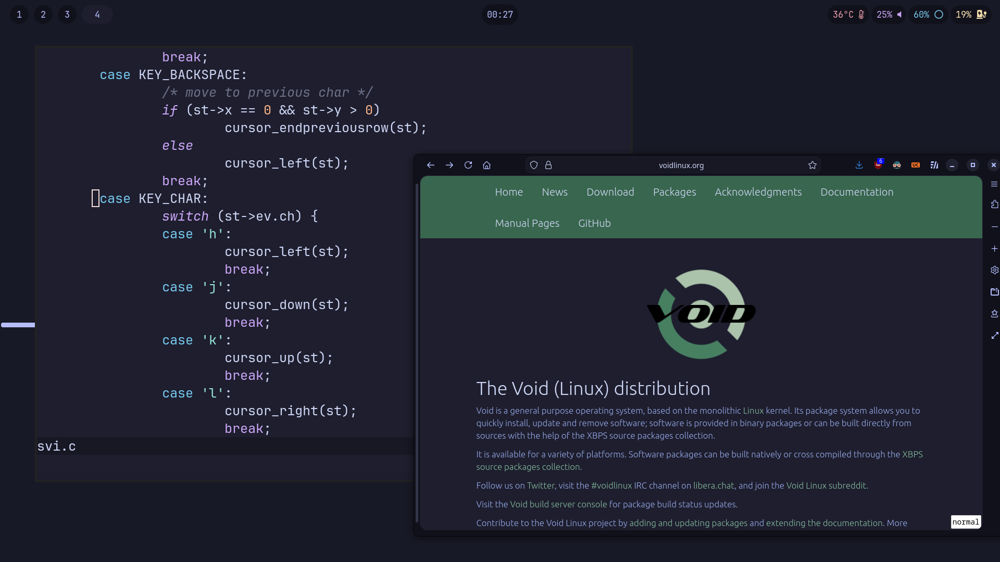

# my dotfiles



sway + waybar + alacritty + zsh

NOTE: this repo was initially made as just a way for me to easily replicate my setup somewhere else, there might be stuff that's not relevant for your system and stuff

# installation

there's a handy install script that you can use:

```
curl -fLO https://raw.githubusercontent.com/iusevoidbtw/dotfiles/master/install.sh
# inspect install.sh to make sure it's safe to run
sh install.sh
```

the same as above, as a one-liner:

```
sh -c "$(curl -fsSL https://raw.githubusercontent.com/iusevoidbtw/dotfiles/master/install.sh)"
```

alternatively, you can clone the repo and install the files manually. in this case, make sure you have the following installed:

```
# these apps are used by these dotfiles:
sway swaybg alacritty zsh waybar

# these apps are also used in the dotfiles but can be easily replaced/removed in the configs:
sway-launcher-desktop bashmount lf slurp grim wl-copy fzf zoxide

# these apps are not used by these dotfiles but have provided configs for them in the dotfiles:
bat nvim

# you'll also need oh-my-zsh (https://ohmyz.sh/) (optionally with the zsh-autosuggestions plugin)
# and the JetBrains Mono nerd fonts.
# if you want the Neovim config to work properly, you'll also need vim-plug.
```
